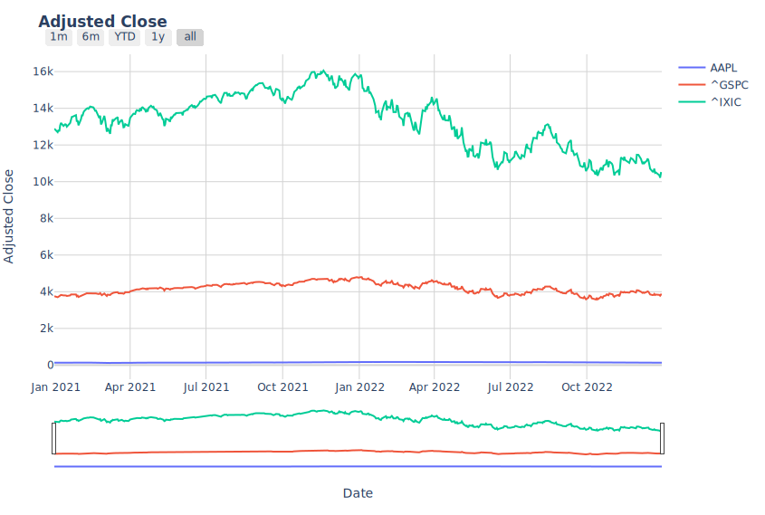

# Plotting Some Data
This section gives some examples on how to create plots for a few data items - quite a lot of data that is available is not covered here.


## Packages Used

 - *DataFrames.jl* for easier data handling
 - *Dates.jl* because we need dates ;) 
 - *PlotlyJS.jl* for our plots
  
  
## Load the packages:
```julia
using YFinance
using DataFrames
using Dates
using PlotlyJS
```
  
  
## Retriev price information for AAPL 
Here we use intraday price information.
```julia
AAPL = get_prices("AAPL",interval = "1m",range="1d")
```
  
  
# OHLC Plot (Intraday)
  
## Plot Layout 
This is not really needed just styles the plot and adds a rangeslider and rangeselector.
```julia
# Creates the Layout for our plots (not really needed unless you want to style the plots)
function plot_layout_minute(title="") 
    l =  Layout(
        title_text = "<b>$(title)</b>",
        paper_bgcolor =:white,
        plot_bgcolor =:white,
        yaxis = attr(
            gridcolor=:lightgrey,
            griddash="dot",
            zerolinecolor=:lightgrey),
        xaxis=attr(
            gridcolor=:lightgrey,
            griddash="dot",
            zerolinecolor=:lightgrey,
            rangeslider_visible=true,
            rangeselector=attr(
                buttons=[
                    attr(count=5, label="5m", step="minute", stepmode="backward"),
                    attr(count=10, label="10m", step="minute", stepmode="backward"),
                    attr(count=15, label="15m", step="minute", stepmode="backward"),
                    attr(count=30, label="30m", step="minute", stepmode="backward"),
                    attr(count=1, label="1h", step="hour", stepmode="backward"),
                    attr(count=2, label="2h", step="hour", stepmode="backward"),
                    attr(count=5, label="5h", step="hour", stepmode="backward"),
                    attr(step="all")
                    ])))
    return l
end;

#Dictionary to map column names to strings displayed on the plot (also not needed unless for styling of the plots)
labels=Dict(
        :returns => "Return",
        :log_ret => "Log Return",
        :index => "Wealth Index",
        :timestamp =>"Date",
        :open => "Open",
        :high => "High",
        :low => "Low",
        :close =>"Close",
        :adjclose =>"Adjusted Close",
        :vol =>"Volume",
        :ticker => "Ticker");
```
  
  
## The Plot:
```julia

# Lets start with a OHLC Plot:
# creates a OHLC plot 
function ohlc_plot(data::OrderedDict)
    p = Plot(candlestick(
            x=data["timestamp"],
            open=data["open"],
            high=data["high"],
            low=data["low"],
            close=data["close"],
            increasing_line_color="turquoise",
            decreasing_line_color="darkgray",
            labels=labels #delete this argument for no styling of the plot
            ),
            plot_layout_minute(data["ticker"]) # delete this argument for no styling of the plot
            )
    return p 
end;

ohlc_plot(AAPL)
```

  
  
  
# Plot Multiple Items
For illustration I used Apple (AAPL), the S&P500 (^GSPC), and the NASDAQ (^IXIC) for this.
  
## Download Data and convert to DataFrame
```julia
# Lets get multiple tickers and stack them into a dataframe!
# Downloads data and stacks it into a dataframe
function get_long_df(symbols::AbstractVector{<:AbstractString},interval,range)
    p = get_prices.(symbols,interval=interval,range=range);
    p = vcat([DataFrame(i) for i in values(p)]...);
    p.timestamp = Date.(p.timestamp);
    return p
end;

#Download a Price
prices =  get_long_df(["AAPL","^GSPC", "^IXIC"],"1d","2y")
```
  
  
## OHLC Plot of a specific ticker
  
### Plot Layout 
This is not really needed just styles the plot and adds a rangeslider and rangeselector.
```julia
# Lets start with a OHLC Plot:
# creates a OHLC plot for a specific ticker

function plot_layout(title="") 
    l =  Layout(
        title_text = "<b>$(title)</b>",
        paper_bgcolor =:white,
        plot_bgcolor =:white,
        yaxis = attr(
            gridcolor=:lightgrey,
            griddash="dot",
            zerolinecolor=:lightgrey),
        xaxis=attr(
            gridcolor=:lightgrey,
            griddash="dot",
            zerolinecolor=:lightgrey,
            rangeslider_visible=true,
            rangeselector=attr(
                buttons=[
                    attr(count=1, label="1m", step="month", stepmode="backward"),
                    attr(count=6, label="6m", step="month", stepmode="backward"),
                    attr(count=1, label="YTD", step="year", stepmode="todate"),
                    attr(count=1, label="1y", step="year", stepmode="backward"),
                    attr(step="all")
                    ])))
    return l
end;
```
  
### The Plot:
```julia
function ohlc_plot(data::DataFrame,symbol::AbstractString)
    p = Plot(candlestick(data[isequal.(data.ticker,symbol),:],
            x=:timestamp,
            open=:open,
            high=:high,
            low=:low,
            close=:close,
            increasing_line_color="turquoise",
            decreasing_line_color="darkgray",labels=labels),
            plot_layout(symbol) )
    return p 
end;

ohlc_plot(prices,"AAPL")
```

  
  
  
## Comparsion Plot - raw prices
```julia
# Let's compare how the stocks have performed over time:
# Creates a comparison plot of the price for all items
function comparison_plot(data::DataFrame,column::Symbol=:adjclose)
    return Plot(data, x=:timestamp,y=column,group=:ticker,labels=labels,
    plot_layout(labels[column]))
end;
comparison_plot(prices)
```

  
  
## Comparison Plot - Wealth Index
For better comparison we first calculate returns and afterwards a wealth index then plot that.
```julia

# Calculate Return
function get_return(x::AbstractVector{<:Number})
    res = x[2:end]./x[1:(end-1)]
    return vcat(missing,res.-1)
end;

# Calculate Wealth Index
function wealthIndex(x::AbstractVector,base=100)
    res = vcat(1,x[2:end])
    res = log.(res.+1)
    res = exp.(cumsum(res)) .- 1
    return res.*base
end;

# groupby ticker and calculate returns and the wealth index
transform!(groupby(prices,:ticker),
    :adjclose => get_return => :ret)
transform!(groupby(prices,:ticker),
    :ret => wealthIndex => :index)

# Now lets plot the price index instead of the adjclose 
comparison_plot(prices,:index)
```

  
  

# ESG Data Bar Chart
Bar Chart comparing ESG scores between AAPL and its peers
## Download ESG Data
Download ESG data and convert to a DataFrame and reshape to long format for easier plotting
```julia
esg = get_ESG("AAPL")
esg = vcat([DataFrame(i) for i in values(esg)]...) #convert to DataFrame
subset!(esg, :timestamp => x -> isequal.(x,maximum(x))) # take only the newest values
esg = DataFrames.stack(esg,[:esgScore,:environmentScore,:governanceScore,:socialScore]) #reshape into long format
```
  
## Plotting:
```julia
function create_barplot()
    esg[!,"colors"]= ifelse.(isequal.(esg.symbol,"AAPL"),"darkorange","steelblue")

    traces = bar(esg,x = :variable, y = :value,group=:symbol,names=:symbol,marker_color=:colors)

    layout = Layout(barmode="group",
        legend=attr(
            x=1,
            y=1.02,
            yanchor="bottom",
            xanchor="right",
            orientation="h"),
            paper_bgcolor =:white,
            plot_bgcolor =:white
            )
    return Plot(traces, layout)
end
create_barplot()
```

  

  
# Pie Chart of the major Holders
  
## Downloading the Data
```julia
major_holders  = get_major_holders_breakdown("AAPL")
```
  
## Creating the Pie Chart
```julia
function create_pie() 
    colors = ["darkorange","steelblue","teal"] # Set Colors
    rest = (1-major_holders["insidersPercentHeld"] - major_holders["institutionsPercentHeld"])
    values = [major_holders["insidersPercentHeld"], major_holders["institutionsPercentHeld"],rest].*100
    plot(
        pie(values = values,
        labels = ["Insiders","Institutions","Rest"],
        marker_colors = colors),
        Layout(title_text = "<b>Major Holders</b>"))
end;
create_pie()
```
